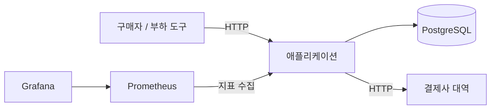
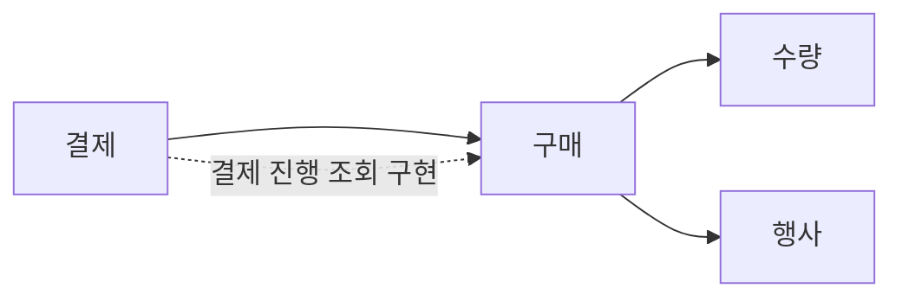
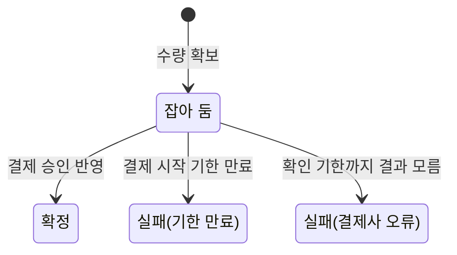
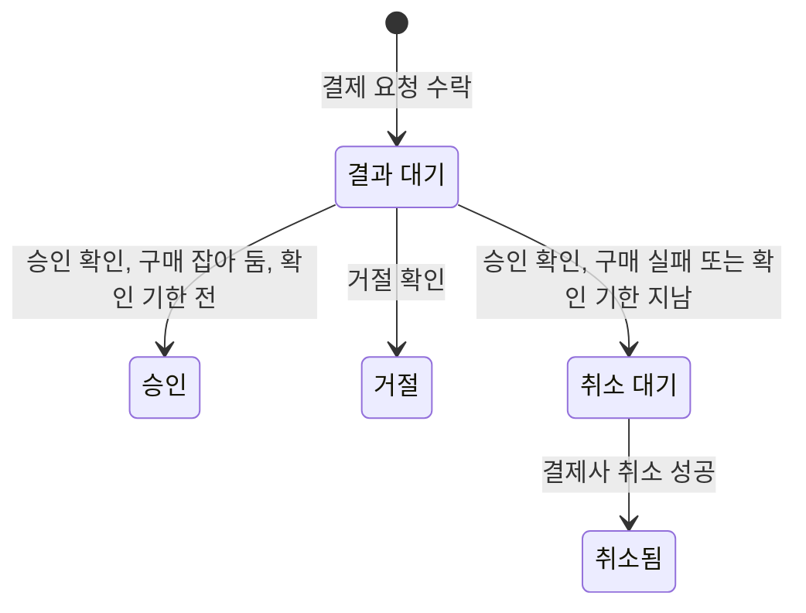
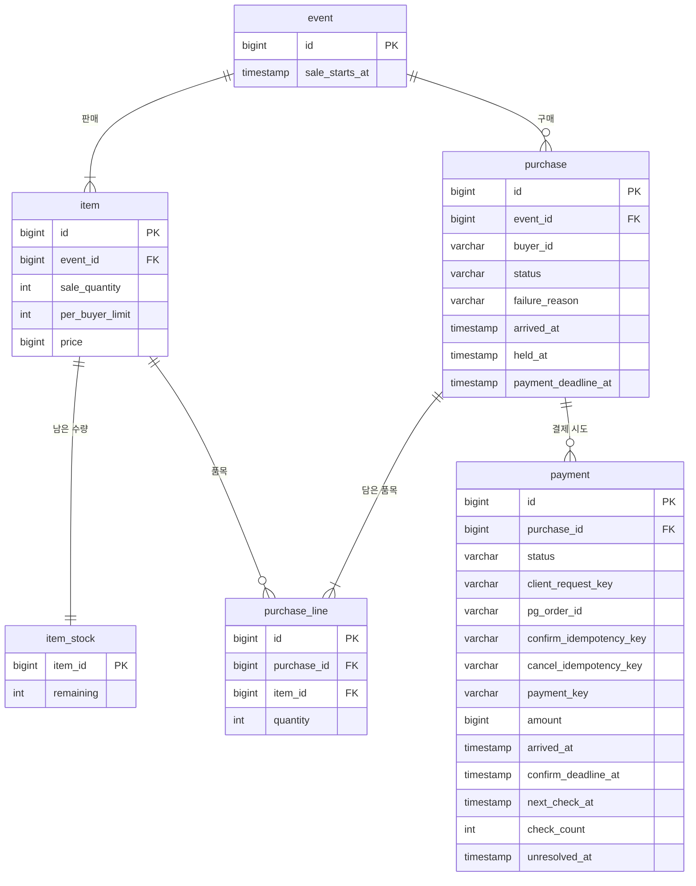

# 4. 설계

[정책과 시나리오](03-policies-scenarios.md)를 지키기 위한 구성이다. 모듈 내부 구현은 적지 않는다. 선택 이유는 [ADR](adr/)에 있다.

## 인프라



| 구성 | 선택 | 근거 |
|---|---|---|
| 런타임 | Java 21, Spring Boot, Gradle | 제약: JVM, Spring |
| DB | PostgreSQL 1개 | 목표 A의 범위. [ADR-0001](adr/0001-postgresql.md) |
| 결제사 | 대역. 아래 [결제사 대역](#결제사-대역) | 목표 B의 범위 |
| 측정 | k6, Micrometer, Prometheus, Grafana | C 측정 구간 |
| 실행 | 애플리케이션은 단일 인스턴스. DB, 결제사 대역, 측정 도구는 애플리케이션과 따로 실행한다 | 목표 A의 범위, 같은 조건으로 다시 측정 |

캐시, 메시지 큐, 비동기 접수는 기본 구성에 넣지 않는다. C의 개선 후보이며, 기준선을 먼저 재고 측정 결과로 정한다. 자원 한도와 k6의 실행 위치는 기준선 측정 전에 정해 실험 기록의 고정 조건에 적는다.

## 애플리케이션 구성

애플리케이션은 단일 인스턴스로 실행하고, 구매 요청과 재처리를 함께 맡는다.

### 재처리

앱 안의 스케줄러가 DB에서 처리할 행을 주기적으로 찾는다. 대상은 결제 시작 기한이 지난 구매, 결과를 모르는 결제, 취소할 결제다. 여러 실행이 같은 행을 집지 않도록 잠긴 행은 건너뛰고 가져온다(`FOR UPDATE SKIP LOCKED`).

확인 주기의 영향은 작업마다 다르다.

- 결제 시작 기한 만료: 기한 뒤의 결제 요청은 만료 처리 전이라도 무효라(T1) 그 구매의 결과는 바뀌지 않는다. 수량이 돌아오는 시점이 늦어지고, 그동안 다른 구매자는 품절을 받는다.
- 결제 결과 재확인: 앱이 승인을 알게 된 시각이 확인 기한 뒤면 구매는 실패하고 결제는 취소된다(P8, B9a). 조회 시점이 최종 결과를 바꾸므로, 기한 전 마지막 조회를 어떻게 보장할지는 확인 기한, 재시도 간격과 함께 정한다.

주기는 C에서 바꿔 볼 변수다. [ADR-0002](adr/0002-db-polling-scheduler.md)

### 결제사 대역

앱은 결제사 인터페이스(승인, 조회, 취소)에만 의존하고, 구현을 둘 둔다.

| 구현 | 쓰는 곳 | 하는 일 |
|---|---|---|
| 메모리 대역 | 시나리오 테스트 | 거절, 무응답, 늦은 승인, 취소 실패를 원하는 순간에 만든다 |
| HTTP 대역 | 부하 측정, HTTP 연결 테스트 | 별도 프로세스. 지연, 무응답, 늦은 승인, 취소 실패를 설정으로 만든다 |

HTTP 대역은 토스페이먼츠 API의 형태를 따른다: 승인(`POST /v1/payments/confirm`), 주문 번호로 조회(`GET /v1/payments/orders/{orderId}`), 취소(`POST /v1/payments/{paymentKey}/cancel`), POST 요청의 `Idempotency-Key`(같은 키는 첫 응답을 돌려준다), 오류 본문(`code`, `message`). 실제 결제사 테스트 환경은 결제창 인증 없이 승인할 수 없고 무응답과 늦은 승인을 만들 수 없어 쓰지 않는다. ([토스페이먼츠 API 요약](https://docs.tosspayments.com/guides/v2/get-started/llms-quick-reference))

### 시각

- **도착 시각**: 앱이 요청을 처음 받는 지점에서 기록한다. Q2의 순서와 역전, T1의 기한 판단에 같은 값을 쓴다. 앱 안에서 기다린 시간(스레드, 커넥션 풀, 잠금)으로 생긴 역전도 역전으로 잰다.
- **시계**: 앱은 현재 시각을 주입받는다. 테스트에서 시각을 조절하기 위해서다.

## 레이어

패키지는 모듈별로 먼저 나누고, 모듈 안에 레이어를 둔다. 고도화(입장 제어 등)는 모듈을 더하는 형태로 붙인다. 시계처럼 여러 모듈이 쓰는 것은 공통 패키지에 둔다.

```text
<기본 패키지>
├─ <모듈>
│  ├─ web
│  ├─ application
│  ├─ domain
│  └─ infra
└─ common
```

| 레이어 | 맡는 일 | 의존할 수 있는 곳 |
|---|---|---|
| web | HTTP 요청과 응답, 도착 시각 기록 | application |
| application | 유스케이스, 트랜잭션 경계, 결제사 호출 순서. 결제사 인터페이스를 정의한다 | domain, common |
| domain | 엔티티, 상태 전이 규칙, 저장소 인터페이스 | common |
| infra | 결제사 HTTP 구현 | application(결제사 인터페이스) |

외부 경계(결제사, 시계)와 모듈 사이의 순환을 끊는 곳만 인터페이스로 두고, DB는 인터페이스 뒤로 숨기지 않는다. 수량 정합성(A)은 DB의 조건부 갱신과 잠금에서 지켜지므로 테스트도 실제 DB로 하기 때문이다.

### DB 접근

Spring Data JPA를 쓰고, 엔티티를 도메인 모델로 그대로 쓴다. [ADR-0004](adr/0004-jpa-explicit-contention-queries.md)

- 수량과 상태를 바꾸는 경합 경로는 조건부 갱신 쿼리(`UPDATE ... WHERE <조건>`)로 쓰고, 영향받은 행 수로 성공을 판단한다. 엔티티 변경 감지에 맡기지 않는다.
- 조건부 갱신은 영속성 컨텍스트를 거치지 않아, 이미 읽어 둔 엔티티에는 갱신 전 값이 남는다. 같은 트랜잭션에서 갱신 뒤의 값을 써야 할 때만 컨텍스트를 비우거나(`clear`) 그 엔티티를 다시 읽는다(`refresh`).
- 비우거나 다시 읽기 전에는 버려질 미반영 변경이 없어야 한다. `clear`는 반영하지 않은 모든 엔티티 변경을, `refresh`는 그 엔티티의 변경을 버린다. 갱신 앞에 엔티티 변경이 있는 흐름이면 갱신 전에 반영(`flush`)하고, 없는 흐름이면 반영 단계를 두지 않는다. 쿼리 실행 전 자동 반영에 기대지 않고 흐름에서 직접 보장한다.
- 경합 경로의 트랜잭션은 가능하면 조건부 갱신만으로 쓰고, 엔티티 변경과 섞지 않는다.

### 트랜잭션과 결제사 호출

결제사 호출은 DB 트랜잭션 밖에서 한다. [ADR-0003](adr/0003-payment-call-outside-transaction.md)

1. 트랜잭션 1: 기한(T1)과 진행 중 결제(P2)를 검사하고, 결제 시도를 "결과 대기"로 기록한다. 결제사에 보낼 주문 번호와 멱등키도 이때 정해 기록한다.
2. 결제사 호출: 트랜잭션 밖에서 한다.
3. 트랜잭션 2: 결과를 조건부 갱신으로 반영한다.

응답이 없거나 앱이 중간에 멈추면 "결과 대기" 기록이 남고, 재처리가 이를 찾아 결제사에 조회한다(P7).

## 모듈



| 모듈 | 책임 | 다른 모듈에 제공하는 것 |
|---|---|---|
| 행사 | 행사, 품목, 판매 시작 시각, 판매 수량, 1인 한도, 가격. 미리 등록된 정보를 읽기만 한다 | 판매 정보 조회 |
| 수량 | 품목별 남은 수량 | 잡기(품목·수량 목록 → 성공 또는 품절), 반환(품목·수량 목록) |
| 구매 | 구매와 구매 품목, 1인 한도, 결제 시작 기한과 만료, 구매 상태 조회 | 결제 시작 확인, 확정, 결제사 오류로 실패 |
| 결제 | 결제 시도, 결제사 호출, 재확인, 취소 | 결제 진행 조회(구매가 정의한 인터페이스의 구현) |

- 의존은 결제 → 구매 → 수량, 구매 → 행사 한 방향이다. 구매가 결제 정보를 알아야 하는 곳(만료 조건 T2, 구매 상태 조회)은 구매가 "결제 진행 조회" 인터페이스를 정의하고 결제가 구현한다. 결제 상태는 결제 행에만 둔다.
- 수량의 잡기와 반환은 부르는 쪽의 트랜잭션 안에서 실행된다. 수량 모듈은 구매를 모른다.
- 결제 시작 확인은 구매 행을 잠그고 "잡아 둠"인지와 결제 시작 기한(T1)을 검사한다. 기한이 지났으면 거절하면서 그 자리에서 만료 전이를 실행한다(B5a).
- 재처리 스케줄러는 담당 모듈 안에 둔다. 결제 시작 기한 만료는 구매, 결제 재확인과 취소는 결제가 맡는다.

## 상태 전이

같은 구매를 바꾸는 반영(결제 수락, 결과 반영, 만료)은 모두 구매 행을 먼저 잠그고 시작한다(T2). 결제 요청과 만료가 겹쳐도 둘 중 하나만 일어난다(B6). 구매 품목은 따로 상태를 두지 않고 구매 상태를 따른다. 수량 확보에 실패한 시도(판매 시작 전, 품절, 한도 초과)는 구매를 남기지 않는다.

### 구매



| 전이 | 조건과 함께 일어나는 일 | 규칙 |
|---|---|---|
| → 잡아 둠 | 판매 시작 뒤 도착, 진행 중 구매 없음, 1인 한도 이하, 모든 품목의 수량 확보. 결제 시작 기한을 정한다 | Q1, Q2, Q3 |
| 잡아 둠 → 확정 | 결제 승인을 확인 기한 전에 기록함 | P3, B4 |
| 잡아 둠 → 실패(기한 만료) | 결제 시작 기한이 지났고, 결과 대기 중인 결제도 승인된 결제도 없음. 수량을 반환한다 | P5, P6, T2 |
| 잡아 둠 → 실패(결제사 오류) | 결과 대기 중인 결제가 확인 기한을 넘김. 재처리가 기한을 발견했을 때와, 기한 뒤에 결과(승인 또는 거절)를 반영할 때 일어난다. 수량을 반환한다 | P8, B9, B9a |

수량은 "잡아 둠"에서 실패로 바꾸는 데 성공한 트랜잭션만 반환한다(Q4, Q5, R1).

### 결제 시도

구매 하나에 결제 시도가 여럿 생길 수 있다(P4). 결과(승인, 거절)를 반영할 때는 먼저 반영 시각이 확인 기한 전인지 본다. 기한 뒤라면 결과와 상관없이 그때까지 결과를 몰랐던 것이므로 P8을 따르고, 결제 시작 기한(5분)에 따른 판단(P3, P4, P5)은 확인 기한 안에 반영한 결과에만 쓴다(T1).



| 전이 | 조건과 함께 일어나는 일 | 규칙 |
|---|---|---|
| → 결과 대기 | 구매가 잡아 둠, 도착 시각이 결제 시작 기한 전, 결과 대기 중인 다른 결제 없음. 확인 기한을 정한다 | P1, P2, T1 |
| 결과 대기 → 승인 | 확인 기한 안에 승인을 반영함. 같은 트랜잭션에서 구매를 확정한다 | P3, B1, B7 |
| 결과 대기 → 거절 | 확인 기한 안: 결제 시작 기한 전이면 구매는 그대로 두고(다시 결제 가능), 지났으면 그 자리에서 만료 전이를 실행한다. 확인 기한 뒤: 구매가 아직 잡아 둠이면 같은 트랜잭션에서 실패(결제사 오류)로 바꾸고 수량을 반환한다. 결제는 어느 쪽이든 거절로 끝난다 | P4, P5, P8, T1 |
| 결과 대기 → 취소 대기 | 구매가 아직 잡아 둠이면 같은 트랜잭션에서 실패(결제사 오류)로 바꾸고 수량을 반환한다 | P8, B8, B9a |
| 취소 대기 → 취소됨 | 취소 요청에 멱등키를 붙여 결제사에 한 번만 반영되게 한다 | R1, B10, B12 |

- 구매가 실패(결제사 오류)로 끝나도 결제는 결과 대기로 남아 계속 확인한다. 거절로 확인되면 끝나고, 승인으로 확인되면 취소 대기로 간다(P8).
- 미해결은 상태가 아니다. 결과 대기와 취소 대기 행에 미해결 시각을 표시하고 재시도를 계속한다(R1, B11).

## ERD



| 테이블 | 제약과 인덱스 | 지키는 것 |
|---|---|---|
| item_stock | 잡기는 `remaining >= n` 조건부 갱신. 잡기와 반환은 같은 행의 갱신이라 차례로 일어난다 | 초과 판매 0, 반환과 잡기가 겹쳐도 수량이 맞음 (Q2, Q5, A1, A2, A7) |
| purchase | `(event_id, buyer_id)` 부분 고유, 상태가 잡아 둠인 행만 | 진행 중 구매 하나 (Q3, A3, A4) |
| purchase | `(event_id, buyer_id)` 인덱스 | 1인 한도 합계 조회 |
| purchase | `payment_deadline_at` 부분 인덱스, 잡아 둠인 행만 | 만료 대상 조회 |
| purchase_line | `(purchase_id, item_id)` 고유 | 구매 안에서 품목 중복 없음 |
| payment | `purchase_id` 부분 고유, 결과 대기인 행만 | 결제는 한 번에 하나 (P2, B3) |
| payment | `pg_order_id` 고유, `(purchase_id, client_request_key)` 고유 | 결제사 주문 번호 중복 없음, 재전송 구분 자리 |
| payment | `next_check_at` 부분 인덱스, 결과 대기·취소 대기인 행만 | 재확인·취소 대상 조회 (`SKIP LOCKED`) |

- **1인 한도** ([ADR-0005](adr/0005-one-active-purchase-per-buyer.md)): 구매 행을 넣은 뒤 같은 트랜잭션에서 그 구매자의 해당 품목 수량 합계(잡아 둠, 확정)를 세어 한도를 넘으면 롤백한다. 진행 중 구매가 하나뿐이라 합계에 들어가는 다른 행은 동시에 바뀌지 않는다.
- **수량 불변식** ([ADR-0006](adr/0006-stock-remaining-only.md)): 품목마다 `sale_quantity = remaining + 잡아 둔 구매의 수량 합 + 확정된 구매의 수량 합`. 남은 수량과 구매 품목은 따로 기록되므로 서로를 검사한다. 확정은 `item_stock`을 바꾸지 않는다.
- **여러 품목**: 품목이 늘면 `item`, `item_stock`, `purchase_line` 행이 늘 뿐 구조는 같다. 여러 품목을 잡을 때는 품목 ID 순서로 잡아 교착을 피한다.
- **금액**: 결제 금액은 서버가 품목 가격 × 수량으로 계산해 결제 시도에 기록하고 결제사에 보낸다. 클라이언트가 보낸 금액은 쓰지 않는다.
- **구매자**: 가입과 로그인이 없으므로 테이블을 두지 않고 `buyer_id` 값으로만 구분한다.
- **재확인 값**: `confirm_deadline_at`, `next_check_at`, `unresolved_at`을 정하는 값은 [결제 재확인과 재시도](#결제-재확인과-재시도)에, `client_request_key`의 쓰임은 [결제 요청 재전송](#결제-요청-재전송)에 있다.

## API

구매자는 `X-Buyer-Id` 헤더로 구분한다. 요청을 처리했으면 2xx와 결과 상태를, 규칙에 막혀 처리하지 않았으면 4xx와 오류 본문(`code`, `message`)을 돌려준다.

| 요청 | 처리함 (2xx) | 규칙에 막힘 (4xx) |
|---|---|---|
| `POST /events/{eventId}/purchases`<br>`{items: [{itemId, quantity}]}` | 201 잡아 둠 `{purchaseId, paymentDeadlineAt}`<br>200 진행 중인 구매가 있으면 그 구매 (Q3) | 409 `NOT_STARTED`(Q1), `SOLD_OUT`, `LIMIT_EXCEEDED` |
| `POST /purchases/{purchaseId}/payments`<br>헤더 `Idempotency-Key` | 200 승인(구매 확정)<br>200 거절(다시 결제할 수 있는지와 기한)<br>202 결제 확인 중 (P7) | 400 `IDEMPOTENCY_KEY_REQUIRED`<br>409 `PAYMENT_IN_PROGRESS`(P2), `PAYMENT_DEADLINE_PASSED`(T1), `PURCHASE_CLOSED` |
| `GET /purchases/{purchaseId}` | 200 구매자에게 보이는 상태 | 404 없거나 다른 구매자의 구매 |

C의 측정 구간은 응답으로 나뉜다. 구매 시도 → 결과는 첫 요청의 응답, 결제 요청 → 첫 응답은 두 번째 요청의 응답, 최종 결과는 세 번째 요청을 확정이나 실패가 나올 때까지 조회한 시점이다.

### 결제 요청 재전송

- 결제 요청에는 `Idempotency-Key` 헤더가 있어야 한다. 키는 `payment.client_request_key`에 기록한다.
- 같은 구매에 같은 키가 다시 오면 결제사를 부르지 않고 처음 시도의 현재 결과를 돌려준다(승인·거절 200, 결과 대기 202).
- 다른 키는 새 결제 시도다. 결과 대기 중인 결제가 있으면 409로 거절한다(P2).

### 구매자에게 보이는 상태

| 보이는 상태 | 구매 | 결제 시도 |
|---|---|---|
| 결제 대기 | 잡아 둠 | 결과 대기 없음 |
| 결제 확인 중 | 잡아 둠 | 결과 대기 있음 |
| 확정 | 확정 | |
| 실패(기한 만료) | 실패(기한 만료) | |
| 실패(결제사 오류) | 실패(결제사 오류) | 취소 대기 없음 |
| 실패, 결제 취소 처리 중 | 실패(결제사 오류) | 취소 대기 있음 (B11) |

## 결제 재확인과 재시도

아래 값은 초기값이다. 설정으로 두고, 측정 결과를 보고 조정한다. 테스트에서는 시계를 조절한다.

| 항목 | 초기값 | 규칙 |
|---|---|---|
| 결제사 호출 제한 시간 | 3초. 넘으면 결제 확인 중(202)으로 응답하고 재확인으로 넘긴다 | P7 |
| 확인 기한 | 결제 요청 수락 후 1분 | P7, P8 |
| 재시도 간격 | 1초에서 두 배씩, 상한 1분, ±20% 무작위 | R1 |
| 미해결 | 첫 시도 후 10분. `unresolved_at`만 표시하고 시도는 계속한다 | R1, B11 |
| 재처리 주기 | 1초 | [ADR-0002](adr/0002-db-polling-scheduler.md) |

- **기한 전 마지막 조회**: 구매가 잡아 둠인 동안 `next_check_at`은 `확인 기한 − (호출 제한 시간 + 재처리 주기)`보다 늦지 않게 잡는다. 그때도 결과를 모르면 `next_check_at`을 확인 기한으로 잡아, 기한이 되면 P8 전이를 실행한다. 결제는 그 뒤에도 재시도 간격대로 확인한다.
- **상태 조회**: 구매자의 상태 조회는 DB만 읽고 결제사를 부르지 않는다. 결제사 조회는 재처리만 한다. [ADR-0007](adr/0007-payment-recheck-by-reprocessing-only.md)
- **흔듦**: 몰림 뒤에 생긴 결과 대기 결제들의 재확인이 같은 순간에 몰리지 않게 간격을 흔든다.

## 측정 자료

Q2의 역전은 구매 시도마다 남기는 구조화 로그(도착 시각, 결과, 수량을 받은 시각)로 측정 뒤에 센다. 거절된 시도는 구매를 남기지 않으므로 DB 대신 로그에 남긴다. 수량을 받은 시각은 품목 행을 잠근 채로 기록해, 행을 갱신한 순서와 같게 한다. 로그는 측정 설정에서만 켜고, 켜고 끈 결과를 비교해 로그의 부하를 확인한다.
